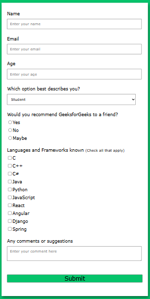

# Projects For Week 1 (10 days)

## Project 1: Survey Form

**What You Will Build:**

- A responsive and user-friendly survey form using HTML and CSS
- Includes text fields, checkboxes, and radio buttons for user input
- Clean, visually appealing, and easy-to-navigate design
- Collects user responses in an organized way
- Adapts to both desktop and mobile screens

**HTML Form Resource :** 
- [Link](https://www.youtube.com/watch?v=2O8pkybH6po&pp=ygUKaHRtbCBmb3Jtcw%3D%3D)

**Project Preview:**

**Tools Needed:**

- VS Code
- Web Browser
- GitHub for deploying

**Project-Submission**:

- Guidelines : [Project-submission-guidelines](../project-submission.md)
