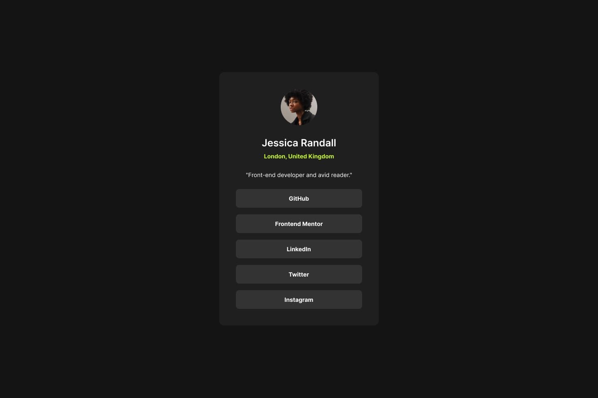

# Projects For Week 1 (10 days)

## Project 2: Social Link-Sharing Profile (FlexBox)

**What You Will Build:**

- A personalized social link-sharing profile using HTML and CSS FlexBox
- Display social media links in a visually appealing flex container
- Responsive design for desktop and mobile screens
- Clean, user-friendly interface
- You can choose your own colors

**FlexBox Resource :** 
- [Link](https://www.youtube.com/watch?v=fYq5PXgSsbE&pp=ygUPY3NzIGZsZXhib3ggdHV0b3JpYWw%3D)

**Color Chooser :**
- [Choose your colors](https://coolors.co/palettes/trending)

**Project Preview:**

**Note:** Add Dummy url for links

**Tools Needed:**

- VS Code
- Web Browser
- GitHub for deploying

**Project-Submission**:

- Guidelines : [Project-submission-guidelines](../project-submission.md)
