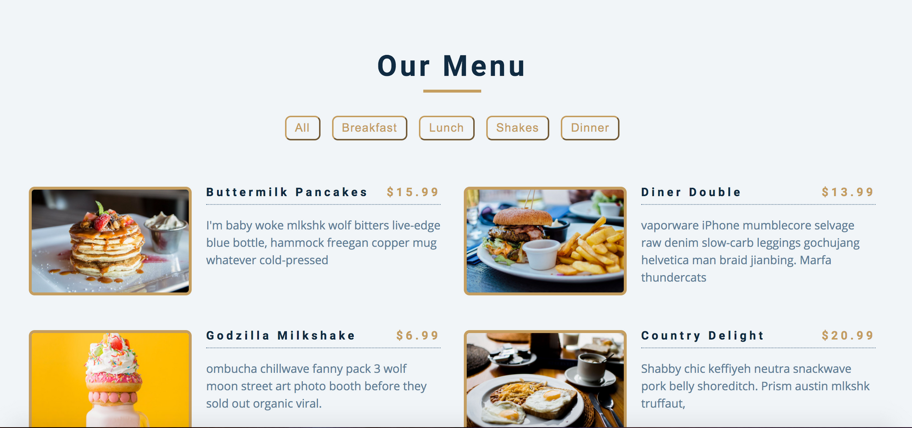

# Projects For Week 1 (10 days)

## Project 3: Restaurant Menu Page Clone

**What You Will Build:**

- A static restaurant menu page clone using HTML and CSS
- Practice real-world Flex and Grid layout techniques
- Menu filter buttons are present but non-functional (no JavaScript)
- Focus on layout, design, and responsiveness
- Great for understanding Flex and Grid in real website scenarios

**Key Concepts Covered:**
- CSS Flexbox
- CSS Grid
- Responsive design
- Layout structuring
- Semantic HTML

**Project Preview:**

## Note:

### Not exactly like that the image with colors are not needed, just try to use flex and grid to structure and design it

**Tools Needed:**
- VS Code
- Web Browser
- GitHub for deploying

**Project-Submission**:
- Guidelines : [Project-submission-guidelines](./project-submission.md)

