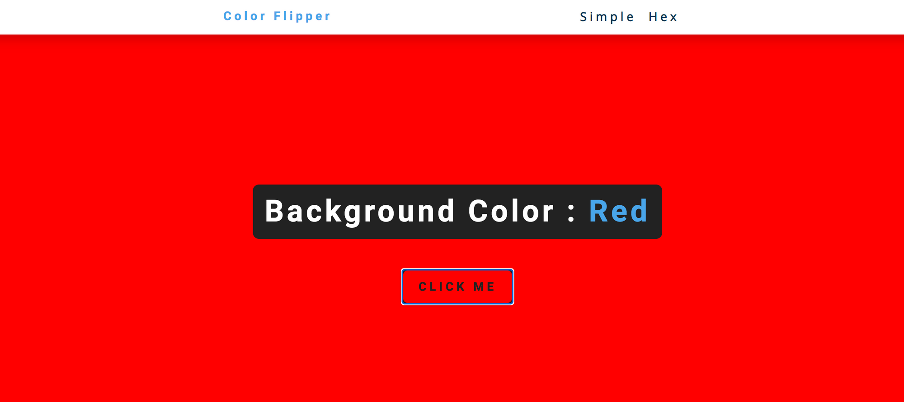

# Projects For Week 1 (10 days)

## Project 4: Color Flipper

**What You Will Build:**

- A random background color changer (Color Flipper) using HTML, CSS, and JavaScript
- Practice DOM manipulation and event handling
- User clicks a button to change the background color to a random value
- Simple, interactive, and fun project to understand the DOM

**Key Concepts Covered:**
- Arrays
- document.getElementById()
- document.querySelector()
- addEventListener()
- document.body.style.backgroundColor
- Math.floor()
- Math.random()
- array.length

**Project Preview:**

**Note :** You can pick color by using [Color Picker](https://coolors.co/palettes/trending)

**Tools Needed:**
- VS Code
- Web Browser
- GitHub for deploying

**Project-Submission**:
- Guidelines : [Project-submission-guidelines](./project-submission.md)

**If you struggle with building this project you can refer this :** [Link](https://www.youtube.com/watch?v=3PHXvlpOkf4&t=0s)

#### Watch this first 30 min of video
