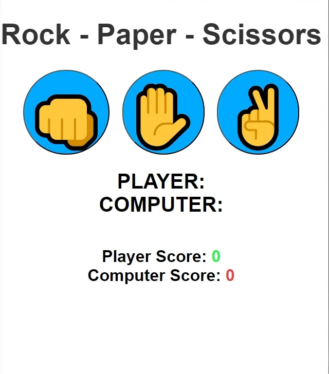
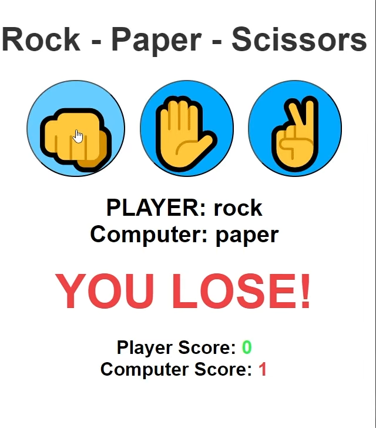
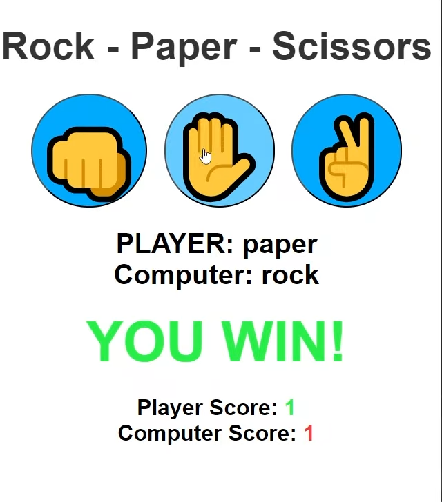
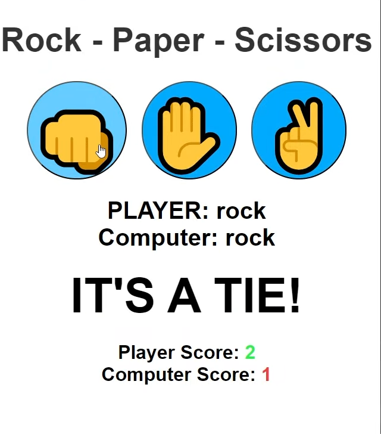

# Projects For Week 1 (10 days)

## Project 5: Rock Paper Scissors Game

**What You Will Build:**

- A classic Rock Paper Scissors game using HTML, CSS, and JavaScript
- Practice DOM manipulation, event handling, and game logic
- User plays against the computer, with real-time score updates
- Interactive UI with visual feedback for each move
- Responsive design for desktop and mobile

**Key Concepts Covered:**
- Arrays
- Functions
- Event listeners
- DOM manipulation
- Conditional logic
- Math.random()

**Tutorial Resource:**
- [YouTube: Build Rock Paper Scissors Game](https://youtu.be/3uKdQx-SZ5A)

**Project Preview:**

**Note:** You can use emojis for rock, paper, and scissors from [getemoji.com](https://getemoji.com/)

**Tools Needed:**
- VS Code
- Web Browser
- GitHub for deploying

**Project-Submission**:
- Guidelines : [Project-submission-guidelines](./project-submission.md)

**If you struggle with building this project you can refer this :** [Link](https://youtu.be/3uKdQx-SZ5A)
